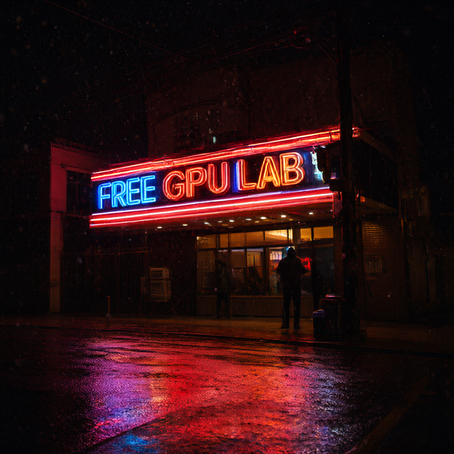
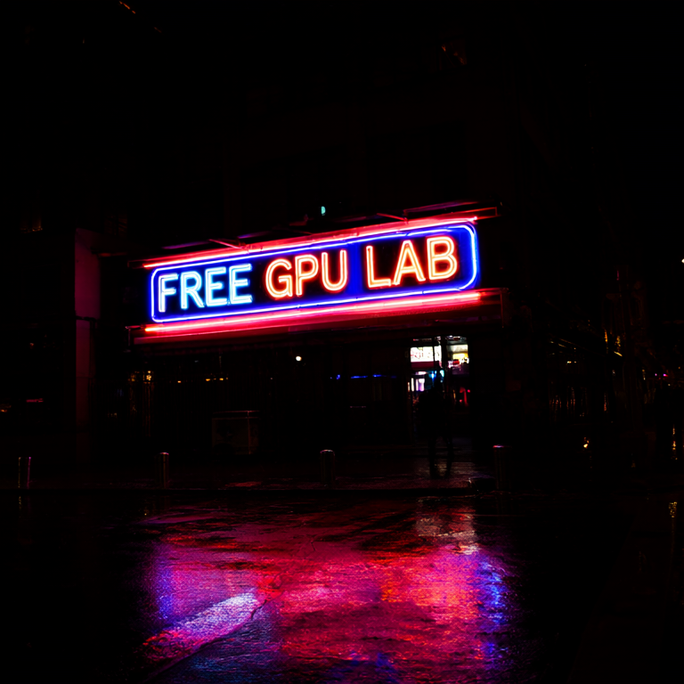

# run-qwen-image-on-free-colab

Run **Qwen-Image-2.1** (7B diffusion transformer, GGUF-quantized) as a real
text-to-image service on a **free** Colab T4 — and call it **from any
machine** through a public API URL. Every number in this repo was measured on
an actual free T4, and every gotcha was paid for in a real failed run.
Nothing is aspirational.

Written to be **executed by an agent** (any coding agent — no special tools
or MCPs required, only Bash + Python) while keeping the human's manual part
to a couple of clicks. If you are an agent: read
[SKILL.md](SKILL.md) first and follow its routing table.

## What you get

| Path | What | Human effort |
|---|---|---|
| **Notebook** ([colab/run-qwen-image-t4.ipynb](colab/run-qwen-image-t4.ipynb)) | open in Colab, pick T4, Run all → installs ComfyUI, downloads the model, generates a sample, prints a public API URL | ~2 min of clicking + ~10 min waiting |
| **Public text-to-image API** | `clients/txt2img.py` (Python stdlib only) from any machine against the printed URL | zero — the URL is the token |
| **Agent/CLI lane** | the same notebook run headlessly by an agent | one OAuth consent |
| **Tuning receipts** | the measured speed table and which knobs do/don't help | reading |

[](https://colab.research.google.com/github/KodeIsFun/run-qwen-image-on-free-colab/blob/main/colab/run-qwen-image-t4.ipynb)

## The measured table (free Colab T4, Q4_K_M GGUF fully in VRAM)

| Config | s/step | Warm image |
|---|---|---|
| 1024², 20 steps, fp32 (ComfyUI's default cast on T4) | 38.0 | 765.6 s |
| 768², 12 steps, fp16 (no-LoRA baseline) | 6.20 | 79.2 s † |
| **768², 6 steps, fp16 + Viggle turbo LoRA, CFG off** (this repo's settings) | **2.68** | **21.0 s** |

† measured on the original abenzerps weights (now 404 — see below). On the
current unsloth weights the same no-LoRA baseline runs 69.1 s, so the honest
same-weights speedup of the turbo row is **3.3×**, and the whole table spans
**over 36×**. None of the levers is what people guess:

- The T4 has no bf16, so ComfyUI silently runs the model in **fp32** unless
  you force fp16 — but fp16 then crashes ComfyUI's model compiler on this
  card (`aimdo memory compile error`), so the flags are a pair:
  `--force-fp16 --disable-comfy-compiler`.
- "Use a smaller quant for speed" does nothing: the step is compute-bound.
  Quants decide *what fits in VRAM*, not how fast it runs.
- Fewer steps alone breaks text rendering (measured: 4 steps → the sign is
  illegible). The turbo row works because it is a **distilled LoRA applied
  correctly**: the author's runtime-hook node (never merged into the
  weights), the author's resolution-shifted sigma schedule, and CFG fully
  off — six forward passes per image instead of twenty-four.

## The images these settings produce

All generated on a free Colab T4 with exactly this repo's settings and seed
42 (raw outputs from the measured runs, untouched). Top row: the turbo
default — 768×768, 6 steps, CFG off, ~21 s warm. Bottom row: the no-LoRA
baseline — same prompt, same seed, 12 steps:

| Photoreal | Text rendering |
|---|---|
|  |  |
| turbo 6-step: 72.1 s incl. first-time model loads | turbo 6-step: **every word spelled correctly, 21.0 s warm** |
|  |  |
| baseline 12-step: 127.9 s incl. model loads | baseline 12-step: spelled correctly, 79.2 s warm |

That text-rendering column is the point: **"FREE GPU LAB" survives
quantization + fp16 at both 6 turbo steps and 12 baseline steps** — but only
the turbo row is a distilled LoRA; naive 4-step (no LoRA) collapses the same
sign into illegible glow.

Proof artifacts from the verification run ship in
[colab/run-qwen-image-t4_output.ipynb](colab/run-qwen-image-t4_output.ipynb)
and [colab/proof-served-through-tunnel.png](colab/proof-served-through-tunnel.png)
(generated on the VM, fetched through the public tunnel from a different
machine).

## Quickstart (human, browser only)

1. Click the badge above → sign in with Google.
2. *Runtime → Change runtime type → T4 GPU → Save.*
3. *Runtime → Run all* → approve → wait ~10 minutes.
4. Copy the `API URL: https://...trycloudflare.com` line, then from any
   machine:

   ```bash
   python3 clients/txt2img.py --url https://...trycloudflare.com \
     --prompt 'a neon shop sign that reads "FREE GPU LAB", rainy night' \
     --out my-first-image.png
   ```

Details, caveats (ephemeral URLs, idle VMs, license), and the agent-driven
path: [references/01-manual-steps.md](references/01-manual-steps.md).

## Repo map

```
SKILL.md                     ← agents start here (routing + 12 invariants)
colab/run-qwen-image-t4.ipynb        ← the notebook (built, verified on a fresh T4)
colab/run-qwen-image-t4_output.ipynb ← the executed notebook from the verification run
colab/proof-served-through-tunnel.png ← image fetched through the public tunnel
samples/                     ← raw outputs: turbo 6-step + no-LoRA baseline, same prompts/seed
clients/txt2img.py           ← stdlib-only client (turbo default, --no-turbo baseline)
workflows/t2i-turbo.json     ← the verified turbo workflow graph (6 steps, CFG off)
workflows/t2i-api.json       ← the verified no-LoRA baseline workflow graph
references/01-manual-steps.md    ← the human's (tiny) part, verbatim scripts to say
references/02-colab-cli-lane.md  ← agent lane: install, auth, exec, artifacts
references/03-api-from-anywhere.md ← the API surface + client + curl
references/04-tweaking.md    ← measured table, knobs, what does NOT help
references/05-troubleshooting.md ← 14 entries, all paid for in real runs
tools/build_notebook.py      ← regenerates the notebook (edit here, not in the ipynb)
scripts/verify_env.py        ← sanity-check a machine before driving the lane
```

## Status

- [x] Notebook verified cell-by-cell on a fresh free T4 (2026-09-21; turbo
      update re-verified 2026-09-26)
- [x] API URL proven reachable from outside Colab; image served through the tunnel
- [x] `txt2img.py` tested end-to-end through the tunnel (turbo + `--no-turbo`)
- [x] Viggle turbo LoRA verified on free-tier GGUF weights (2026-09-26)
- Untested, honestly labeled: turbo at 1024², cfg 1.0 without the LoRA at 12
  steps, Q8_0 speed, `LoraLoaderModelOnly` merge quality

Model: base [Qwen/Qwen-Image-2.1](https://huggingface.co/Qwen/Qwen-Image-2.1)
— GGUF by [unsloth](https://huggingface.co/unsloth/Qwen-Image-2.1-GGUF) and
[abenzerps](https://huggingface.co/abenzerps/Qwen-Image-2.1-GGUF) (text
encoder + VAE); turbo LoRA by
[Viggle](https://huggingface.co/Viggle/Qwen-Image-2.1-viggle-turbo) — all
under the **Qwen Research License** (non-commercial). Sibling repo for LLMs:
[run-llm-on-free-gpu](https://github.com/KodeIsFun/run-llm-on-free-gpu).
